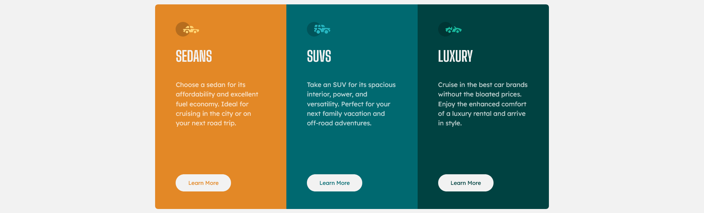

# Frontend Mentor - 3-column preview card component solution

This is a solution to the [3-column preview card component challenge on Frontend Mentor](https://www.frontendmentor.io/challenges/3column-preview-card-component-pH92eAR2-). Frontend Mentor challenges help you improve your coding skills by building realistic projects. 

## Table of contents

- [Overview](#overview)
  - [The challenge](#the-challenge)
  - [Screenshot](#screenshot)
  - [Links](#links)
- [My process](#my-process)
  - [Built with](#built-with)
  - [What I learned](#what-i-learned)
  - [Continued development](#continued-development)
  - [Useful resources](#useful-resources)
- [Author](#author)

**Note: Delete this note and update the table of contents based on what sections you keep.**

## Overview

### The challenge

Users should be able to:

- View the optimal layout depending on their device's screen size
- See hover states for interactive elements

### Screenshot

### Links

- Solution URL: [Add solution URL here](https://github.com/Shadowbest/preview-cards)
- Live Site URL: [Add live site URL here](https://compassionate-leakey-db1691.netlify.app/)

## My process

### Built with

- Semantic HTML5 markup
- CSS Custom Properties
- CSS Flexbox
- CSS Grid
- Mobile-first workflow

### What I learned

This was a fun little project to complete, a very nice component. Quite frankly there ins't much (if anything) that I learned I didn't know already. This is the fourth or fith challenge that I take on from Frontendmentor.io and I plan to continue doing more challenges to brush up my Wed Dev Skills.

I think the most important skill is to deploy this project with Netlify instead of GitHub Pages.

### Continued development

While very simple project, sometimes is not easy to replicate the designs. It is my focus to continue developing a good eye on design details, accessibility, and web technologies overall.

### Useful resources

For this specific challenge I did not have to search for a solution to a particular problem. Still some resources about HTML, CSS have been found to be valuable over time.

- [MDN](https://developer.mozilla.org/en-US/) - Mozilla Developer Network has been a good resource for both HTML and CSS
- [Traversy Media](https://www.youtube.com/c/TraversyMedia) - This youtube channel is a great resource for learning web technologies as well as many others on a higher level.
- [Kevin Powell](https://www.youtube.com/user/KepowOb) - Kevin Powell's youtube channel is a great one about tricks and tips as well concepts on CSS. Incredible channel to learn one or two tricks as well as learning how CSS works.

**Note: Delete this note and replace the list above with resources that helped you during the challenge. These could come in handy for anyone viewing your solution or for yourself when you look back on this project in the future.**

## Author

- Frontend Mentor - [Shadowbestfc](https://www.frontendmentor.io/profile/Shadowbest)
